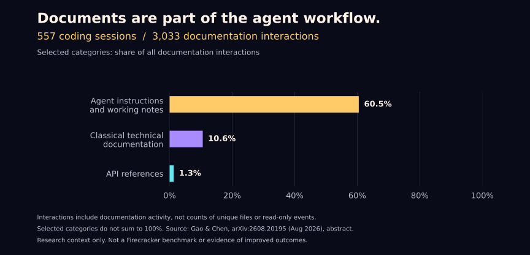

<p align="center">
  
</p>

<h1 align="center">Firecracker</h1>
<p align="center"><strong>身处不同位置，共望同一束烟花。</strong></p>
<p align="center">让项目中的文档随着项目演进，始终朝向共同的目标。</p>

<p align="center">
  <a href="README.md">English</a> · <a href="README.ko.md">한국어</a> · <a href="README.zh-CN.md">简体中文</a>
</p>

---

**文档越来越多，它们还在朝着同一个方向吗？**

随着项目推进，规格说明、实现计划、API 指南和运维手册不断积累，分散在不同目录中。决策和功能持续演进，相关说明却不一定同步更新。一份文档单独看起来很合理，与其他文档放在一起时，却可能在描述不同的项目。

**Firecracker 检查不断增长的文档是否仍然遵循项目已确认的方向。** 它将文档中的主张与现有决策、相关实现关联起来，指出偏差，并帮助你在修改之前审阅变更计划。

身处不同位置，共望同一束烟花。项目决定那束烟花的方向，每份文档保留自己的角色和视角。

## 文档也是 AI 开发过程的一部分



研究报告在 **557 次编码会话中观察到 3,033 次文档交互**。这不是独立文档数量，也不只是阅读次数；图中仅展示部分分类。[来源：Gao 与 Chen 的公开摘要](https://arxiv.org/abs/2608.20195)。

**我们的理解是：既然文档为工作提供指引，就应当主动维护其中决策的一致性。** Firecracker 关注这一维护问题。该研究并未验证 Firecracker 的效果，也未证明文档是最重要的因素。

[图表数据与解读范围](references/research-context.md)

## 什么时候使用

- 功能已经从 **A 演进到 A+**，但不确定所有相关文档是否都已更新。
- 多位成员或编码代理在不同目录中创建了大量文档。
- 重新接手项目时，难以区分当前规范、未来计划和历史记录。
- 交接或发布前，希望检查相互冲突的指引和遗漏的更新。
- 希望保留旧文档的价值，同时找出适合清理的内容。

## 项目的方向由你决定

Firecracker 的职责是根据项目已有的决策检查文档一致性。它不会在文档审查过程中决定新的产品方向、架构或政策。

| 你可能担心 | 工作流程如何应对 |
| --- | --- |
| “如果它误解了我的项目呢？” | 展示判断依据、适用范围和原文证据。意图不明确时报告为未解决项，并保留相关内容。你可以在执行前纠正其理解。 |
| “它会为了迁就错误代码而修改正确文档吗？” | 区分已确认的需求和观察到的实现。代码缺陷按代码缺陷报告，不能成为削弱需求的理由。 |
| “它会让所有文档都说同样的话吗？” | 保留文档角色、环境差异、未来目标和历史记录。只有同一适用范围内无法兼容的主张才属于冲突。 |
| “只让它检查，也会修改文件吗？” | 默认审查为只读操作，先报告发现和建议。修改依据具体计划及执行授权进行。 |
| “旧文档会被删掉吗？” | 仅凭陈旧、缺少链接或阅读记录不会删除文档。清理候选项需说明依据和引用影响，删除需要明确授权。 |

这些是工作原则，并非对完美理解的保证。Firecracker 可能遗漏上下文或误判证据，因此会将结论作为可审阅的建议，公开不确定性和未检查范围。对于尚未明确的项目意图，最终判断权属于你。

**先检查，再审阅证据，最后决定修改什么。** 如果你明确要求同时制定并执行计划，它会在授权范围内继续，无需重复确认。

[安装](#安装) · [前后对比](#前后对比) · [使用方法](#使用方法) · [局限](#局限)

## 安装

### 在终端中安装

在终端中运行以下命令，需要 Node.js 和 npm：

```bash
npx skills add Yangms30/firecracker -a codex -g
```

`-a codex` 指定 Codex；`-g` 表示为当前用户安装，可在所有项目中使用。如需仅安装到当前项目，请省略 `-g`。此方式使用社区维护的 [skills CLI](https://github.com/vercel-labs/skills#install-a-skill)。运行 Firecracker 的文档清单脚本还需要 Python 3。

### 通过 Codex 对话安装

也可以在支持内置技能安装器的 **Codex 对话输入框**中粘贴以下请求。这是安装提示词，不是终端命令：

```text
$skill-installer 从 https://github.com/Yangms30/firecracker 安装 Firecracker。
SKILL.md 位于仓库根目录。请同时安装 scripts/、references/、agents/ 和 assets/。
```

<details>
<summary>手动安装 · macOS / Linux</summary>

```bash
mkdir -p ~/.agents/skills
git clone https://github.com/Yangms30/firecracker.git ~/.agents/skills/firecracker
```

请使用尚未占用的目标路径。如果已经安装，请更新现有安装。若仅用于一个项目，将完整文件夹复制到 `<project>/.agents/skills/firecracker/`。

请将 `SKILL.md`、`scripts/`、`references/`、`agents/` 和 `assets/` 保留在一起。文档清单脚本需要 Python 3。参见 [Codex 官方技能指南](https://learn.chatgpt.com/docs/build-skills)。

</details>

安装后，打开需要检查的项目并输入：

```text
$firecracker 检查这个项目的文档，找出相互冲突的决策和过时的说明。
不要修改文件。请报告依据、清理候选项和实际检查范围。
```

## 前后对比

**示例场景：** 已确认的决策要求生成草稿前取得用户批准。上传时仍可进行资料预处理。

| 文档 | 检查前 | 获准修正后 |
| --- | --- | --- |
| 已批准的规格说明 | 仅在批准后生成草稿 | 保留，作为决策依据 |
| API 指南 | 上传后立即开始生成草稿 | 上传用于准备资料；批准后开始生成 |
| 运维手册 | 每次上传后重试草稿生成 | 仅重试已批准的生成任务 |
| 旧会议记录 | 提议自动生成草稿 | 作为历史记录保留 |
| 视觉设计指南 | 字体与间距规范 | 保留；无需加入审批流程 |

**方向一致不意味着内容相同。** 不同环境、未来计划和历史记录可以合理地包含不同表述。

## 检查内容

| 领域 | 检查结果 |
| --- | --- |
| 内容冲突 | 同一范围内不兼容的要求及其来源位置 |
| 变更遗漏 | 仍在描述先前已确认行为的文档 |
| 术语与状态 | 已更名的接口约定、失效引用、被写成已完成的提案 |
| 文档生命周期 | 保留、更新、合并、归档或列为删除候选项 |
| AI 阅读证据 | 根据提供的日志区分已观察到的阅读、部分阅读和未知状态 |
| 检查覆盖范围 | 已审查、待审查、部分审查、受阻、排除的文件及扫描边界 |

## 使用方法

**根据审查结果制定变更计划**

```text
$firecracker 根据审查结果，制定逐文件的变更计划，列出依据和验证方法。
暂时不要修改文件。
对不再需要的文档仅提出删除建议，不要实际删除。
```

**追踪已确认的变更**

```text
$firecracker 草稿生成已从上传后自动触发改为用户批准后触发。
更新受影响的文档，并区分已确认的目标与实际实现状态。
```

**检查先前编码代理的阅读记录**

```text
$firecracker 根据这些编码会话日志，评估各份文档的阅读证据。
另外评估每份文档目前是否仍对项目有用。
```

以上是自然语言请求，不是额外的 CLI 子命令。可以用英语、韩语或中文提出请求；报告使用请求者的语言，修改文档时保留原文语言。

**执行已审阅的计划**

```text
$firecracker 执行已审阅的文档变更计划，并验证结果。
不要删除文档或修改应用代码。
```

## 工作方式

1. **全面盘点。** 统计候选文档，展示目录、格式和排除范围。
2. **分类。** 根据路径和文件名推测角色，再通过内容确认。
3. **理解实现。** 梳理入口，追踪相关功能的 API、任务队列、存储、配置和测试。
4. **比较内容。** 区分已确认决策、当前实现、未来目标和历史记录，依据原文进行比较。
5. **报告。** 不修改文件，报告问题、清理建议以及实际文档和代码检查范围。
6. **制定计划。** 收到变更请求后，列出逐文件的修改、依赖关系和验证方法。
7. **执行与复查。** 执行已批准的计划，并复查相关主题。若用户明确要求同时制定并执行计划，则无需重复确认。

报告将每个问题与证据、适用决策、建议或已执行的操作以及判断的确定程度关联起来。清理建议还会说明替代文档和可能受影响的引用。

<details>
<summary>技能内部结构 · 文档清单脚本</summary>

| 文件 | 用途 |
| --- | --- |
| [SKILL.md](SKILL.md) | 共用的检查与修正指令 |
| [scripts/inventory.py](scripts/inventory.py) | 发现候选文件并计算内容哈希 |
| [references/implementation-and-planning.md](references/implementation-and-planning.md) | 实现证据与变更计划 |
| [references/review-guide.md](references/review-guide.md) | 记录证据、问题与覆盖范围 |
| [references/lifecycle-and-access.md](references/lifecycle-and-access.md) | 清理建议与阅读证据规则 |
| [references/brand.md](references/brand.md) | 烟花主题与呈现规范 |
| [agents/openai.yaml](agents/openai.yaml) | Codex 技能元数据 |

在技能目录中运行：

```bash
python3 scripts/inventory.py /absolute/project/root > /tmp/docs-inventory.json
```

脚本仅生成候选清单，语义审查由 Codex 完成。扫描器识别已知格式及显式指定的匹配模式，跳过指定的依赖与构建目录，不跟随符号链接。特殊格式需要另外检查；PDF 和 Office 内容提取取决于可用工具。

</details>

## 局限

- 文档彼此一致，并不证明实现正确。
- 阅读事件不能证明理解或遵守了内容。没有日志时，阅读状态为未知。
- 仅凭文档陈旧、缺少链接或未观察到阅读记录，不能建议删除。
- 权威决策之间的冲突会保留为未解决项，直到有新的证据或明确决策。
- 审查为只读操作。一般变更请求先生成具体计划；计划获批或用户明确要求制定并执行计划后，再进行修正。删除需要明确授权。
- 如实报告实际覆盖范围，包括无法读取的文件和未审查的部分。

## 语言与设计

[English](README.md) · [한국어](README.ko.md) · [简体中文](README.zh-CN.md)

三份 README 描述同一个技能。执行指令与参考文件以英语维护，不提供按语言分开的检查引擎。更新翻译时，请同步示例、安装步骤与局限说明。

呈现方式参考：[Ponytail](https://github.com/DietrichGebert/ponytail) 的清晰品牌表达与前后对比，以及 [Kill AI Slop](https://github.com/yetone/kill-ai-slop) 的具体示例和直接的安装说明。Firecracker 使用自己的烟花主题与图形，与这两个项目没有关联关系。
